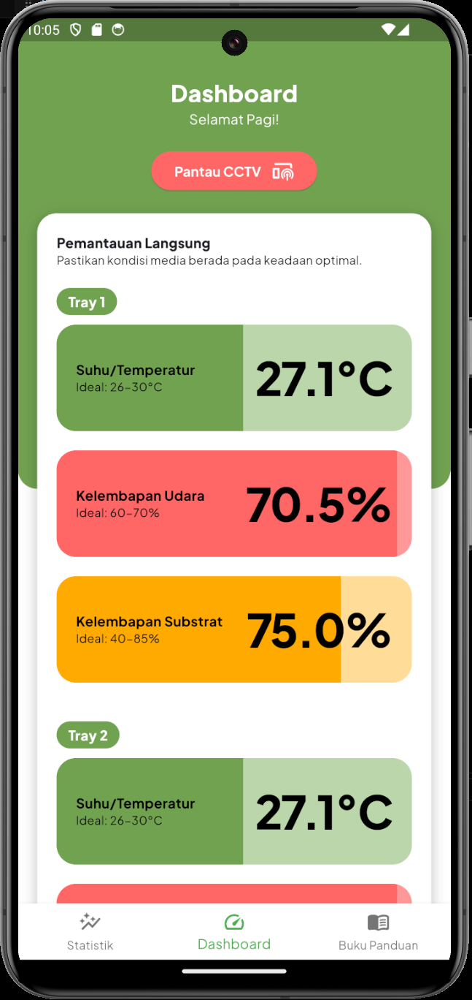
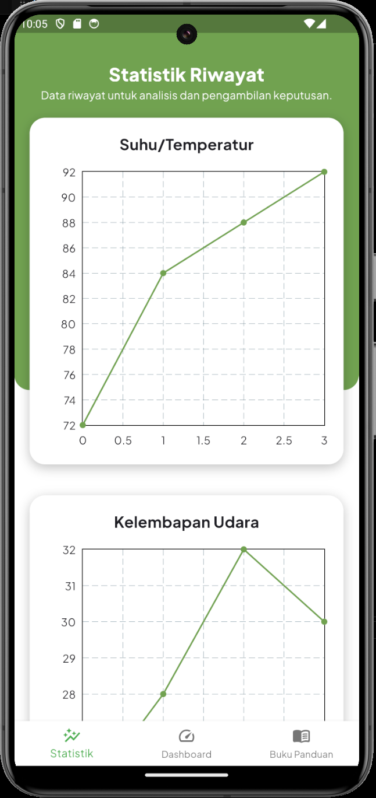
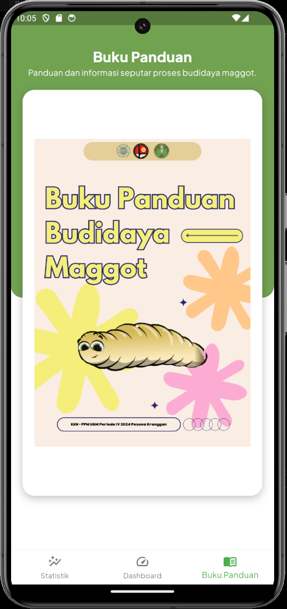
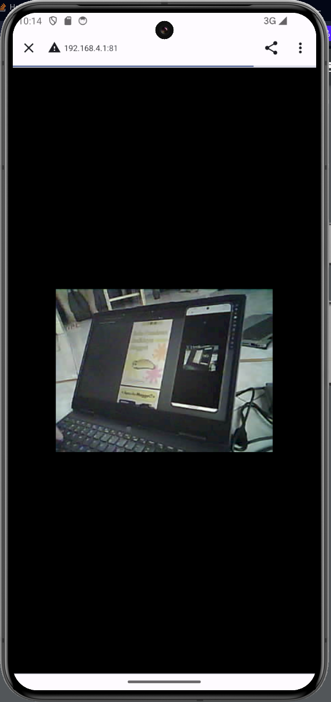

# Ohmaggot!

Flutter-based mobile application designed to support maggot farm monitoring.  
Provides real-time environmental monitoring and historical data visualization to help users track and analyze farming conditions.

## Tech Stack

- **Flutter & Dart**
- **Provider** — State management
- **Firebase** — Sensor data distribution
- **fl_chart** — Data visualization
- **pdfx** — PDF/booklet viewer

## Features

### Real-time Monitoring

- Monitor temperature, air humidity, and substrate moisture.
- Supports monitoring for multiple trays.

    

### Historical Statistics

- Visualize sensor data through line charts.
- Track temperature, air humidity, and substrate moisture over time.

    

### Farming Guide

- Provides a digital booklet containing information and guidance for maggot cultivation.

    

### CCTV Monitoring

- Access live CCTV streams for remote farm monitoring.

    
